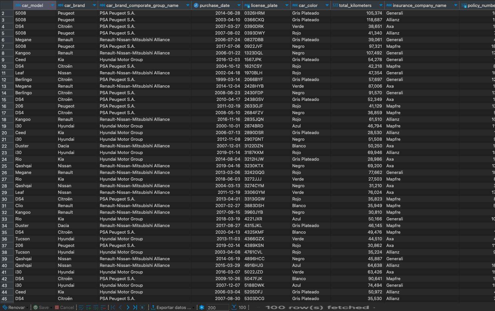

# Keepcoding Introduction to Database Modeling and SQL Exam

## Exam
### Introduction
The practice will consist of solving the practice statement (next section) by creating the normalized Entity-Relationship model and a file with DDL (Data Definition Language) commands for creating the designed model, as well as DML (Data Manipulation Language) commands for loading the tables.

It is mandatory that the script is 100% self-contained so that it only needs to be opened and executed, and it creates everything necessary (tables, primary keys, relationships, data). The script will be executed in PostgreSQL. If an error occurs while executing the script, the practice will not be graded and will be automatically marked as "not suitable." In the script, you should create a workspace and create all objects within that workspace (do not use the "public" schema).

In summary, you will need to deliver a file created in [https://app.diagrams.net/](https://app.diagrams.net/) with the Entity-Relationship model and another file with the SQL script.

###  Exam problem
"At KeepCoding, we want to manage the company's fleet of vehicles by monitoring car models, brands, and the corporate group of the brand (for example: VW SEAT, Audi, etc., belong to the VAN group).

For the cars, we also need to know the car's color, its license plate, the total number of kilometers it has, the insurance company (Mapfre, MMT, AXA, etc.), the policy number, purchase date, and more.

Additionally, we want to keep track of each car's inspections, knowing the kilometers it had at the time of inspection, the inspection date, and the inspection cost.

In addition to the script, we will need to provide an SQL query to extract the following list of active cars at KeepCoding:

-   Model name, brand, and car group (all names).
-   Purchase date.
-   License plate.
-   Car color name.
-   Total kilometers.
-   Name of the insurance company covering the car.
-   Policy number.

Note: Currency should be tracked for the amounts (EURO, DOLLAR, etc.)."

## Exercise 1:  
Entity-Relationship Diagram (ERD) for a Database

**Link to download [The SQL Diagram](exam_db_diagram.drawio.xml)** for importing into [https://app.diagrams.net/](https://app.diagrams.net/)

## Exercise 2: 
Script SQL for:
-   Creating a database,
-   Populating data with a temporary table,
-   Generating a report with the populated data."

**Link to SQL Script: [SQL Script](exam_script.sql)**

### Preview SQL Final Report with the populated data:
